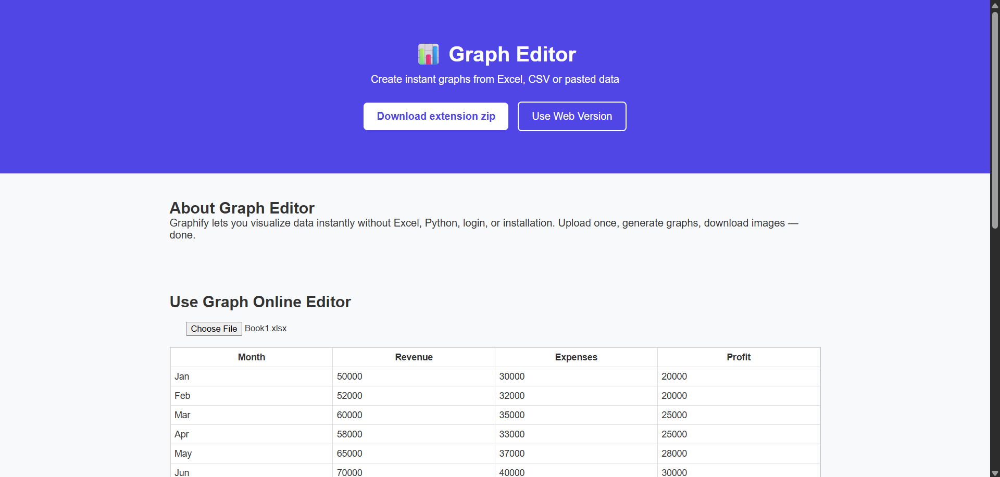
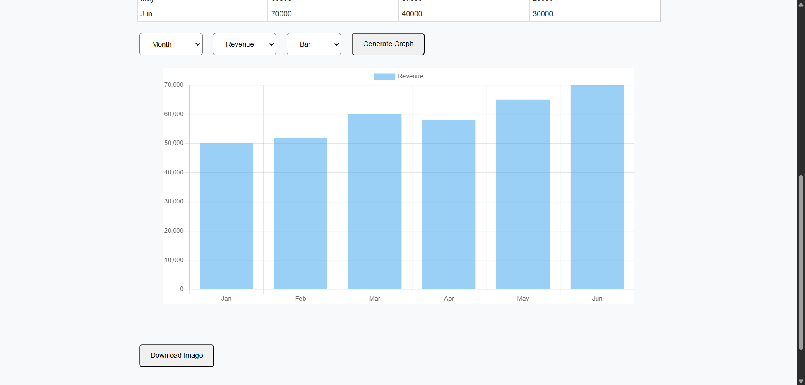
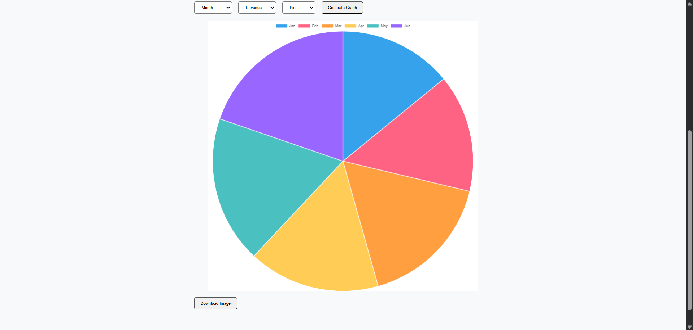

# 📊 Graph Plotter / Editor

A lightweight, privacy-friendly **graph plotting tool** that allows users to upload Excel/CSV files **or directly paste/type data like a spreadsheet**, select columns, and instantly generate downloadable graphs — **without login, without storage, and without saving any data**.

The tool works as:
- 🌐 A **web application** (desktop & mobile)
- 🧩 A **Chrome extension (full editor mode)**

---

## 🖼️ Preview

## 🚀 Features

### ✅ Data Input
- Upload **CSV / Excel (.xlsx)** files
- Paste full data directly from **Excel / Google Sheets**
- Manually type data into an **Excel-like table**
- Editable column headers
- Works even **without uploading any file**

### 📊 Graph Generation
- Select X-axis and Y-axis columns
- Supports multiple chart types:
  - Line chart
  - Bar chart
  - Scatter plot
  - Pie chart
- Live chart preview
- Responsive charts (desktop & mobile)

### 📥 Export
- Download generated graph as **PNG image**
- No stretching or distortion in exported images

### 🔒 Privacy-First Design
- ❌ No login
- ❌ No database
- ❌ No file storage
- ❌ No tracking
- Data exists only in memory while the editor tab is open

---

## 🧩 Chrome Extension Behavior

- The popup acts as a **launcher only**
- Clicking **“Open Editor”** opens a full-page editor in a new tab
- Prevents data loss caused by popup auto-close
- Editor behaves like a normal web app

---

## 🏗️ Tech Stack

### Frontend
- HTML
- CSS
- Vanilla JavaScript
- Chart.js (local bundle)

### Backend
- Python
- Flask
- Pandas
- OpenPyXL

### Hosting (Planned / Optional)
- Frontend (Web): Netlify
- Backend API: Render
- Chrome Extension: Chrome Web Store

---

## 📁 Project Structure

project-root/
│
├── backend/
│ ├── app.py
│ └── requirements.txt
│
├── extension/
│ ├── popup.html
│ ├── popup.js
│ ├── editor.html
│ ├── editor.js
│ ├── editor.css
│ ├── chart.min.js
│ └── manifest.json
│
├── web/
│ ├── index.html
│ ├── app.js
│ └── style.css
│
└── README.md

yaml
Copy code

---

## ⚙️ Backend API (Local Development)

### Run Flask Backend
pip install -r requirements.txt
python app.py
API Endpoint
bash
Copy code
POST /parse
Accepts CSV / XLSX file

Returns column names and preview rows

Stateless (no storage)

🧪 How to Use (Quick Guide)
Option 1: Paste or Type Data
Open the editor

Rename column headers

Type values or paste from Excel

Select columns

Generate graph

Download image

Option 2: Upload File
Upload CSV / Excel file

Preview first rows

Select X & Y columns

Choose chart type

Generate & download

🎯 Design Philosophy
Stateless by default

No barriers (no login, no setup)

Fast & simple

Excel-like familiarity

Beginner-friendly UX

🛠️ Current Status
✅ Core editor complete

✅ Web version working

✅ Chrome extension full editor working

⏳ Deployment pending

⏳ Chrome Web Store publishing pending
